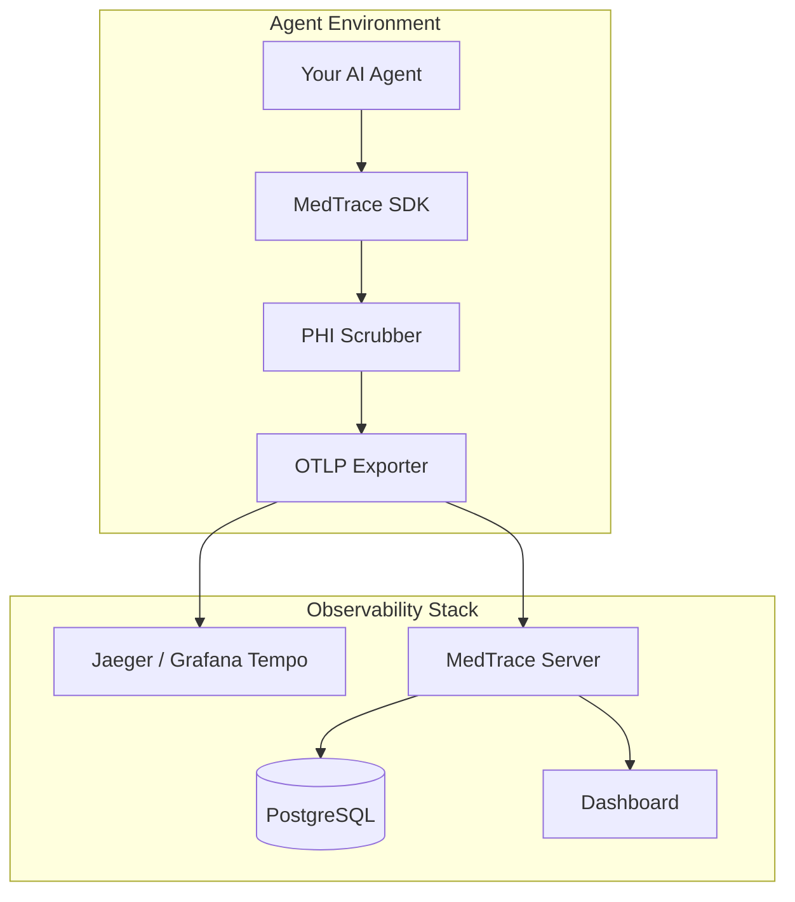

# 🏥 MedTrace-SDK


## 🚀 What it is

**MedTrace-SDK** bridges the clinical observability gap for AI agent pipelines. While standard APM tools focus on system metrics, MedTrace is designed to understand the nuance of healthcare reasoning. It provides high-assurance tracing that captures clinical intent, risk tiers, and safety gate triggers across multi-agent workflows.

Unlike generic tracing libraries, MedTrace is **HIPAA-aware** by design. Every trace passing through the SDK is subjected to localized PHI scrubbing using Microsoft Presidio before export, ensuring that patient data never leaves your environment while maintaining a cryptographically verifiable audit trail.

## 🏗️ Architecture



*Or in simple terms:*
**[Your Agent]** → **[MedTrace SDK]** → **[PHI Scrubber]** → **[OTLP Exporter]** → **[Jaeger / Grafana Tempo]**
*and separately:*
**[MedTrace Server]** → **[Postgres]** → **[Dashboard]**

## ⚡ Quick Start

```bash
pip install medtrace-sdk
```

Instrument your complex agents (including LangGraph) in seconds:

```python
from medtrace import MedTracer

tracer = MedTracer(service="diagnosis-agent", domain="oncology")
app = tracer.instrument_graph(my_langgraph_workflow.compile())

# All node transitions and PHI scrubbing happen automatically
app.invoke({"patient_data": "..."})
```

## 📊 Dashboard


The MedTrace Dashboard is a premium Next.js 14 suite providing real-time visibility into agent safety, latency, and PHI redaction events across your entire fleet.

## ✨ Features

| Feature | Status | Notes |
| :--- | :--- | :--- |
| **PHI Auto-Scrubbing** | ✅ Ready | Presidio + Medical NER integration |
| **LangGraph Support** | ✅ Ready | Recursive `instrument_graph()` patching |
| **Clinical Metadata** | ✅ Ready | OTel-compatible clinical schema |
| **Multi-Agent Tracing**| ✅ Ready | W3C context propagation |
| **Trace Replay** | ✅ Ready | CLI + API state reconstruction |
| **Audit Export** | ✅ Ready | EU AI Act Article 13 / HIPAA compliant |
| **Grafana Dashboard** | 🔜 Coming | Official dashboard templates in v0.2.0 |

## 💻 CLI Reference

Manage your observability lifecycle directly from the terminal:

- `medtrace version` - Display SDK and environment versions.
- `medtrace status` - Check connectivity to the local MedTrace server.
- `medtrace export` - Export NDJSON audit logs for regulatory review.
- `medtrace replay <TRACE_ID>` - Reconstruct and inspect the state of a specific trace.

## ⚖️ Regulatory Alignment

MedTrace-SDK is architected to support documentation requirements for:
- **EU AI Act (Article 13)**: Technical documentation and logging for high-risk AI.
- **FDA SaMD**: Traceability and verification for Software as a Medical Device.
- **HIPAA Safe Harbor**: Automated de-identification of PII/PHI in transit.

## 🤝 Contributing

We welcome contributions to the MedTrace ecosystem! Please see our [CONTRIBUTING.md](CONTRIBUTING.md) for details on our code of conduct and the process for submitting pull requests.

### License
Distributed under the **MIT License**. See `LICENSE` for more information.
